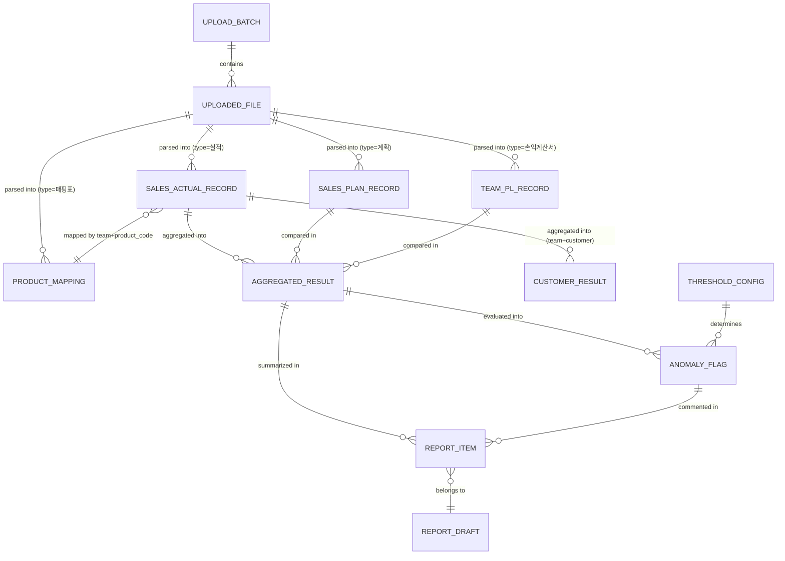
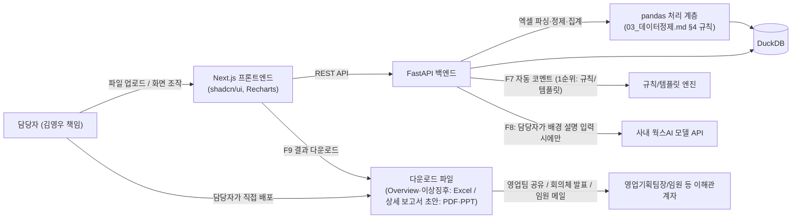

# PRD — 영업실적·손익 분석 및 보고서 자동 생성 Agent

- 작성 대상: 국내영업본부 국내영업기획팀 김영우 책임
- 근거 문서: `01_과제개발기획서_v2.md`
- 버전: MVP (5일 개발 범위, F1~F9 전체 — 최초 3일 PBL 계획에서 5일로 재확정됨)

---

## 1. 문제 정의

국내영업기획팀에는 영업실적·손익 분석 담당자가 김영우 책임 1명뿐이다. 매월 SAP ERP에서 다운로드한 실적·손익 데이터를 엑셀로 수기 가공·집계한 뒤, 전월·전년 대비 증감을 직접 계산해 보고서를 작성한다. 이 과정에 매월 약 12시간(집계·분석 8시간 + 각 영업팀 보고서 수합·점검 4시간 이상)이 소요되며, 수기 입력·집계 오류가 월평균 1~3건 발생한다.

더 심각한 문제는 **분석이 끝나야만 이상징후를 확인할 수 있다는 점**이다. 단가 인상 시기를 놓치거나, 거래처 판매금액을 잘못 설정하거나, 특이 비용 발생을 점검하지 못해 회계 집계 오류 이의제기 시점을 놓치는 사례가 반복되어 왔다. 즉, 문제는 "가공에 시간이 오래 걸린다"는 것뿐 아니라, "가공이 끝난 뒤에야 이상 여부를 알 수 있어 대응이 항상 한 박자 늦다"는 것이다. 담당자가 1명뿐이라 이 흐름을 바꿀 여력도, 교차 검증할 사람도 없다.

## 2. 타겟 사용자 + 페르소나

**타겟 사용자**: 이 웹앱은 국내영업기획팀 담당자 1인 전용으로 설계한다 (사용자 확인 사항). 다중 사용자 권한, 로그인/인증 체계는 MVP 범위에 포함하지 않는다.

### 페르소나 1 — 김영우 책임 (직접 사용자 · 데이터 준비자 겸 분석가)

- 국내영업기획팀 소속, 영업실적·손익 분석 및 보고서 작성 단독 담당
- 코딩 경험 없음, ChatGPT로 단순 검색·문서 작성 경험만 있음 → 복잡한 설정이나 기술 용어 없이 파일 업로드 → 결과 확인의 단순한 흐름을 기대
- 매월 반복되는 가공 작업 자체보다, "무엇이 이상한지"를 최대한 빨리, 놓치지 않고 알고 싶어함
- 실제 최종 판단(오탐지 확인, 배경 설명 보완)은 본인이 반드시 해야 한다고 인식하고 있어, AI 결과를 그대로 배포하지 않고 검토 단계를 거치길 원함

### 페르소나 2 — 영업기획팀장/임원 (간접 이해관계자 · 보고서 소비자)

- 웹앱을 직접 사용하지는 않지만, 김영우 책임이 만든 최종 상세 보고서를 월례 회의체·메일 보고로 받는 대상
- 보고서 형식이 매번 다르거나 이상징후가 늦게 보고되면 의사결정(단가 정책, 비용 통제 등) 타이밍을 놓침
- 표준화된 포맷과 "왜 이상징후로 판단했는지"에 대한 근거(코멘트)를 함께 보고 싶어함

## 3. 목표와 비목표

### Goals

- G1. 월 집계·분석 소요시간을 12시간(1.5일)에서 1~2시간 수준으로 단축한다.
- G2. 수기 입력·집계 오류를 0건으로 만든다 (계산은 전량 자동화).
- G3. 이상징후를 "데이터 가공 완료 후"가 아니라 "업로드 당일·익일"에 확인 가능하게 한다.
- G4. 이상징후 판단 기준을 담당자의 감(感)이 아닌, 조정 가능한 명시적 임계치 로직으로 표준화한다.
- G5. 상세 보고서 초안(그래프+코멘트)을 자동 생성해 보고서 작성 시간을 줄이되, 최종 검토·보완은 담당자가 수행한다.

### Non-goals (MVP 범위 제외, 확인된 사항)

- NG1. 다중 사용자·권한 체계 (영업사원/팀장 조회 계정 등) — **MVP뿐 아니라 로드맵 전체에서 제외 확정** (사용자 확인 사항). 업로드부터 보고서 생성·조회·다운로드까지 담당자(김영우 책임) 1인이 계속 전담한다.
- NG2. SAP ERP API 실시간 연동 — 파일 업로드 방식만 지원
- NG3. 앱 내 이메일 자동 발송/배포 — **MVP뿐 아니라 로드맵 전체에서 제외 확정** (사용자 확인 사항). 배포는 담당자가 다운로드한 파일을 앱 밖에서 수동으로 공유하는 방식을 계속 유지한다.
- ~~NG4. 회의체 발표용 PPT 자동 변환~~ — **범위 축소.** F9에서 상세 보고서 초안을 PPT 포맷으로도 다운로드할 수 있게 하기로 확정했다(미해결 질문 4번 해결, F9 참고). 다만 이는 F7의 그래프+코멘트를 슬라이드로 기계적으로 옮기는 수준이며, 브랜드 템플릿 적용·슬라이드 디자인 자동 편집 등 "발표 자료 자체를 디자인하는" 기능은 계속 MVP 제외다 (5장 v2 표 V1 참고).
- NG5. 매핑표 자동 학습 및 신규 제품코드 자동 분류 — 기획서에서도 Phase 2로 명시된 항목
- NG6. 사내 서버 상시 배포, SSO/인증 연동 — MVP는 로컬/개인 환경 데모 프로토타입까지가 완료 기준. 채택한 아키텍처(11장)는 v2에서 이 배포를 그대로 확장할 수 있도록 설계하되, 서버 배포의 목적은 담당자의 상시 접근 편의이지 경영진 등 타 이해관계자의 직접 열람이 아니다 (NG1·NG3 참고 — 이해관계자 배포는 계속 다운로드 파일 공유 방식).
- ~~NG7. 상세 보고서 자동 생성(F7)·검토·수정(F8)·결과 다운로드(F9)~~ — **폐기.** 개발 기간이 3일에서 5일로 재확정되면서 F7~F9도 다시 MVP에 포함하기로 했다 (미해결 질문 12번 참고, 5장).

## 4. 사용자 스토리

- 담당자로서, SAP에서 다운로드한 실적 파일, 연간 판매계획 파일, 팀별 손익계산서 등 필요한 파일을 개수 제한 없이 그대로 업로드하고 싶다, 그래야 엑셀로 형식을 다시 맞추는 수고를 하지 않을 수 있다.
- 담당자로서, 제품코드-제품군 매핑표를 파일로 함께 업로드하고 싶다, 그래야 매핑 로직을 내가 관리하는 최신 기준으로 유지할 수 있다.
- 담당자로서, 업로드 즉시 지사별·제품별로 정제·집계된 결과를 보고 싶다, 그래야 수작업 가공 단계를 건너뛸 수 있다.
- 담당자로서, 전월·전년 대비 증감률과 계획 대비 달성률을 자동으로 계산해주길 원한다, 그래야 직접 수식을 짜지 않아도 된다.
- 담당자로서, 이상징후 판단 임계치(예: 전월 대비 증감률 기준)를 내가 직접 조정할 수 있길 원한다, 그래야 시기별·상황별로 판단 기준을 유연하게 바꿀 수 있다.
- 담당자로서, 전체 실적 Overview를 한눈에 보고 싶다, 그래야 세부 보고서를 만들기 전에 큰 그림을 파악할 수 있다.
- 담당자로서, 임계치를 초과한 이상 항목을 영향 금액 순으로 정렬해서 보고 싶다, 그래야 가장 중요한 이슈부터 확인할 수 있다.
- 담당자로서, 이상징후별로 AI가 생성한 코멘트가 포함된 보고서 초안을 받고 싶다, 그래야 보고서를 백지에서 작성하지 않아도 된다.
- 담당자로서, AI가 오탐지했거나 문맥(특이비용 배경, 거래처 이슈 등)을 놓친 부분을 직접 수정·보완할 수 있길 원한다, 그래야 부정확한 내용이 그대로 배포되지 않는다.
- 담당자로서, 완성된 보고서를 로컬 파일(엑셀 등)로 내려받고 싶다, 그래야 기존처럼 메일 첨부·회의 자료로 바로 활용할 수 있다.

## 5. 기능 목록

### MVP (5일 개발 범위)

MVP는 F1~F9 전체다 — "업로드 → 정제 → 증감률 계산 → 이상징후 플래그 → Overview → 이상징후 하이라이트 → 임계치 조정 → 보고서 초안 자동 생성 → 검토·수정 → 결과 다운로드"까지 전 과정을 포함한다. (원래 3일 PBL 기준으로 F1~F6만 MVP, F7~F9는 "v1.5"로 분리했었으나, 개발 기간이 5일로 재확정되면서 다시 통합했다 — 미해결 질문 12번 참고.)

| ID | 기능                                                                           | 대응 작업흐름 단계 |
| -- | ------------------------------------------------------------------------------ | ------------------ |
| F1 | 실적 파일, 판매계획 파일, 팀별 손익계산서 등 복수 파일 업로드 (개수 제한 없음) | ①                 |
| F2 | 제품코드-제품군 매핑표 업로드 및 데이터 정제 (계정과목3 산출)                  | ②                 |
| F3 | 증감률·이상징후 자동 계산 (조정 가능한 임계치 기반)                           | ③                 |
| F4 | 전체 실적 Overview 화면                                                        | ④                 |
| F5 | 이상징후 하이라이트 리스트 (영향 금액순 정렬)                                  | ⑤                 |
| F6 | 임계치 설정 화면 (항목별 % 조정)                                               | 참고사항 반영      |
| F7 | 상세 보고서 초안 자동 생성 (그래프 + 코멘트)                                   | ⑥                 |
| F8 | 보고서 초안 검토·수정 (담당자가 직접 편집)                                    | ⑦                 |
| F9 | 보고서/집계 결과 로컬 다운로드 (엑셀)                                          | —                 |

> 임계치 설정(F6)은 F3·F5(증감률 계산·이상징후 플래그)에 필수적인 조정 기능(G4)이며, F5 확인 직후 임계치를 조정하고 그 결과를 반영해 F7(보고서 초안)을 생성하는 순서를 유지한다.

### v2

| ID | 기능                                                                 |
| -- | -------------------------------------------------------------------- |
| V1 | 회의체 발표용 PPT 디자인 자동화 (브랜드 템플릿·슬라이드 레이아웃 편집 — F9의 기본 PPT export를 넘어서는 범위) |
| V2 | SAP ERP API 직접 연동                                                |
| V3 | 보고서 승인/최종화 상태 관리 워크플로우                              |
| V4 | 인증/SSO 연동 (담당자 1인 로그인 보호용 — 역할별 차등 권한 아님)    |
| V5 | 사내 서버 상시 배포 (담당자가 사내 어디서든 상시 접속하기 위한 목적) |
| V6 | 웍스AI 모델 API를 통한 자연어 코멘트 고도화 (F8의 배경 설명 종합 유추를 넘어, F7 자동 코멘트 자체의 자연어 품질 향상 등) |

> **다중 사용자 권한·앱 내 이메일 발송은 로드맵에서 완전히 제외한다** (사용자 확인 사항). 데이터 업로드부터 보고서 생성·조회·다운로드까지 담당자(김영우 책임) 1인이 전담하며, 경영진 등 이해관계자에게는 **담당자가 다운로드한 파일을 직접 배포**하는 방식으로 계속 운영한다. v2의 "사내 서버 상시 배포"도 이 원칙 위에서 담당자의 상시 접근 편의를 위한 것일 뿐, 경영진의 직접 로그인·열람을 의미하지 않는다.

### 이후 단계 (Phase 2+)

| ID | 기능                                               |
| -- | -------------------------------------------------- |
| P1 | 매핑표 자동 학습 — 신규 제품코드 자동 그룹핑/분류 |
| P2 | 다음 달 실적 예측/전망                             |
| P3 | 자연어 질의 기반 인사이트 조회(챗봇)               |
| P4 | 다년도 트렌드 분석                                 |

## 6. MVP 기능별 상세 기능 요구사항

> F1~F9 전체가 MVP다 (5장 참고).

### F1. 파일 업로드

- 업로드 가능한 파일 개수는 2건으로 제한하지 않는다. 실적 통합 파일(SAP 마감 다운로드본), 연간 판매계획 파일, 팀별 손익계산서, **제품분류 매핑표**(제품코드-제품군 매핑표) 등 필요한 파일을 여러 건 업로드할 수 있다.
- **매핑표는 F1 파일 업로드 단계에서 별도 파일로 업로드한다** (사용자 확인 사항). 실적 데이터에 내장되어 있거나 시스템이 별도로 관리하는 자료가 아니라, 매월 담당자가 업로드하는 입력 파일 중 하나다. **매핑표는 제품분류 하나가 아니라 지점코드+제품분류 두 매핑을 함께 담는다**(담당자 확인 — 실적 파일은 [실적 Raw Data] 내용·형식만 업로드하고, 지점코드·제품분류는 향후 하나의 맵핑표 파일로 함께 업로드할 예정). 실제 파일 구조는 [.docs/03_데이터정제.md](03_데이터정제.md) §3(제품분류, 팀+제품코드 → 제품구분1~4)·§3.5(지점코드, 팀+거래처코드 → 권역/사업소/파트, 아직 미구현)를 기준으로 한다.
- 업로드 시 각 파일이 어떤 종류(실적/계획/손익계산서/매핑표)인지 **항상 사용자가 직접 지정한다** (자동 인식 로직 없음 — 사용자 확인 사항, 미해결 질문 6번 해결).
- 필수 파일은 실적 통합 파일 1건이며, 나머지(판매계획, 팀별 손익계산서, 매핑표 등)는 선택적으로 추가 업로드한다. 매핑표를 업로드하지 않으면 이전에 저장된 매핑표를 그대로 사용한다.
- 지원 형식: 엑셀(.xlsx/.xls) 및 CSV.
- 업로드 시 파일 종류별 필수 컬럼(지사, 제품코드, 계정과목1, 계정과목2, 매출/수량, 기간 등) 존재 여부를 검증하고, 누락 시 어떤 파일의 어떤 컬럼이 없는지 구체적으로 안내한다.
- 업로드된 파일들 간 대상 기간(연/월)이 다르면 경고를 표시한다.

### F2. 데이터 정제 및 매핑

- F1에서 업로드된 제품분류 매핑표를 실적·계획·손익계산서 데이터에 조인한다. 조인 키는 단순 제품코드가 아니라 **"팀 구분 + 제품코드" 합성 키**이며(예: `산전MAZ00001`), 매핑표의 제품구분1~4 중 용도에 맞는 컬럼(현재는 제품구분3, 계획비교용)을 선택해 사용한다. 상세 근거는 [.docs/03_데이터정제.md](03_데이터정제.md) §3, §4.1 참고.
- 매핑표에 없는 제품코드가 발견되면 "미매핑" 상태로 별도 표시하고, 집계에서 제외하지 않되 눈에 띄게 구분한다 (누락으로 인한 조용한 오류 방지).
- 계정과목별 정제 로직을 적용해 정제된 실적 테이블을 생성한다. 이 로직은 "계정과목1+계정과목2=계정과목3" 같은 단일 수식이 아니라, 계정과목마다 서로 다른 규칙(원본 값 그대로 사용/여러 항목 합산/두 항목 간 차감/상위 소계에서 하위 항목을 뺀 역산/매출-원가-판관비로 최종 손익 계산)이 적용된다. 항목별 규칙 전체 목록은 [.docs/03_데이터정제.md](03_데이터정제.md) §4를 근거로 한다.
- 팀별 손익계산서가 업로드된 경우, 지사·제품군 단위 실적 집계와 팀 단위 손익 데이터를 함께 구조화해 팀 단위 손익 관점의 분석도 가능하게 한다.
- 지사·제품군·팀 단위로 구조화하고 계획 데이터와 매핑한다.
- **표준원가(S) 계열 컬럼도 보존한다** (F4 ⑥·⑦의 "표준매출원가" 표시용). [.docs/03_데이터정제.md](03_데이터정제.md) §5에서는 실제원가(A)만 채택한다고 정리했으나, F4 실제 참고 양식에 표준매출원가가 별도 지표로 필요하므로 정제 단계에서 폐기하지 않는다 (10장 미해결 질문 14번 참고).

### F3. 증감률·이상징후 자동 계산

- 지사·제품군·계정과목3 단위로 다음을 계산한다: 전월 대비 증감률, 전년 동월 대비 증감률, 흑자→적자 전환 여부, 평균단가 변동(전월+누계평균 통합), 판관비/기타비용 전월 대비 증감률.
- **계획 대비 달성률·손익항목 계획대비는 예외적으로 팀 단위로 계산한다**(사용자 확인 사항 — "각 팀의 제품군에 대한 분석은 전월 또는 누계 평균 대비를 위주로 분석하고, 계획대비에 대한 분석은 팀 계획 vs 팀 실적을 기본으로 한다"). 팀의 제품군별 실적을 합산한 값을 그 팀의 월간 계획과 비교해 팀당 최대 1건만 판정하며, 제품군 단위로는 판정하지 않는다 — 팀의 월간 계획 총액을 제품군 하나의 실적과 비교하면 항상 미달로 나오는 구조적 오류가 있었기 때문이다.
- 아래 항목별 **기본 임계치**를 제안하며, F6에서 담당자가 언제든 조정할 수 있다 (사용자 확인 사항: 고정값이 아닌 설정값으로 설계).

| 판단 기준                  | 판정 단위     | 제안 기본 임계치                         |
| -------------------------- | -------------- | ---------------------------------------- |
| 전월 대비 매출/이익 증감률 | 팀×제품군      | ±10% 이상                               |
| 전년 동월 대비 증감률      | 팀×제품군      | ±15% 이상                               |
| 계획 대비 달성률           | 팀              | 90% 미만 또는 120% 초과                  |
| 손익 흑자→적자 전환       | 팀×제품군      | 조건 충족 시 무조건 플래그 (임계치 없음) |
| 평균단가 변동(전월+누계평균) | 팀×제품군    | ±5% 이상(둘 중 하나라도)                 |
| 판관비/기타비용 급증       | 팀×제품군      | 전월 대비 +20% 이상                      |
| 손익항목 계획대비 증감율   | 팀              | ±10% 이상                               |

- **평균단가 변동**: 당월 평균단가를 전월과 연초~직전월 누계평균 두 기준 모두와 비교하고, 둘 중 하나라도 임계치(기본 ±5%)를 넘으면 하나의 이상징후로 플래그한다(별도 임계치를 두지 않고 기존 단가변동 임계치를 그대로 공유). F5 화면에는 항상 "당월 평균단가 A원, 전월 B원(차이, %), 누계평균 C원(차이, %)"처럼 세 값을 함께 보여준다(사용자 확인 사항 — "누계 평균대비는 별도의 버튼으로 분류하지 말고... 단가 변동에서만 비교해보자"). 과거에는 "누계 평균 대비"가 매출액을 대상으로 하는 독립된 판단 기준이었으나, 이 요청에 따라 폐지하고 평균단가 비교로 흡수했다.
- **손익항목 계획대비**: 손익 상세 분석의 계정과목별 팀 전체 실적을 팀 전체 계획과 비교한 증감율이다(사용자 확인 사항 — "각 구분 항목별 계획 대비 실적의 총액 차 또는 단위당 가격 차이에 대한 판정... 계획대비 실적의 차이(비중차)를 분석할때는 팀단위 비교"). **서술 대상은 사용자가 명시적으로 확정한 15개 항목으로 한정한다**: 원재료비 계·주재료비 계·부재료비·기타재료비 계, 직접노무비 계·간접노무비, 변동경비·고정경비·외주가공비, 기타(상품구매,재고실사차이 등), 변동판관비 계·고정판관비 계, 매출원가, 판관비 계, 단위당 매출액(재료비 계/노무비 계/경비 계 같은 상위 소계와 수량/영업이익은 제외). F7 보고서 초안에 "{팀} {항목}은(는) 단위당 계획 A원 대비 실적 B원으로 C원 상승/하락했습니다. 총액 기준으로는 계획 D원 대비 실적 E원으로 F원(G%) 증가/감소했습니다." 형식의 문장으로 포함된다. **"단위당 매출액"만 예외적으로 총액이 아니라 매출액÷매출수량의 단위당 기준으로만 판정·서술한다** — 매출액 총액 자체는 이미 전월대비/전년대비/계획대비(팀 단위) 3개 기준이 다루므로 중복을 피한다.
- 전년 동월 데이터가 없는 신규 지사/제품군은 전년 대비 항목을 "비교 불가"로 표시하고 계산에서 제외한다 (0%나 임의값으로 대체하지 않음).

### F4. 전체 실적 Overview

Overview는 사용자가 제공한 **실제 사내 보고 양식(엑셀 스크린샷)** 을 근거로 아래 8개 섹션으로 구성한다. 이 양식은 F4의 최우선 근거이며, 이전 버전(5개 영역 추상 서술)을 대체한다.

**팀 목록 (5개, 고정)**: 고정형, 모티브, 산전팀, 차량대리점, 차량OE
**제품군 목록 (3개, 고정)**: 차량AS, 차량OE, 산업용

> ⚠️ 이 팀·제품군 목록은 실제 참고 양식에서 그대로 가져온 것이며, [.docs/03_데이터정제.md](03_데이터정제.md) §4.1에서 분석한 팀 매핑 수식(모티브/고정형/차량대리점/차량OE 4개 분기만 존재, "산전팀" 분기 없음)과 불일치한다. 또한 이전에는 제품군을 "차량대리점/차량OE/산전"으로 서술했으나, 실제 양식은 "차량AS/차량OE/산업용"이다. 이 불일치는 원본 데이터를 다시 확인해야 하므로 그대로 덮어쓰지 않고 10장 미해결 질문 13번에 기록한다. 아래 요구사항은 **실제 양식에 맞춰 잠정 확정**하고, 원본 데이터 재확인 후 필요 시 수정한다.

**① 팀별 목표 대비 실적 (수량·매출)**
당월/누계(YTD) 각각에 대해 팀별 목표(계획)·실적·대비(%)를 수량과 매출액 두 지표로 표시한다. 행: 5개 팀 + 합계.

**② 팀별 목표 대비 실적 (영업이익)**
①과 동일한 구조(당월/누계 × 목표/실적/대비%)를 영업이익 금액과 이익율로 표시한다. 행: 5개 팀 + 합계.

**③ 전년 동월 대비**
전년 동월과 당월 실적을 나란히 놓고, 각각 수량·매출액·이익·이익률(%)·판관비·변동율을 표시한 뒤, "전년대비" 칼럼셋(수량·매출액·이익·이익률(%)·판관비·변동율)을 추가한다. 행: 5개 팀 + 합계.

**④ 전년 누계 대비**
③과 동일한 컬럼 구조를 연간 누계(YTD) 기준으로 표시한다. 행: 5개 팀 + 합계.

**⑤ 전월 대비**
③과 동일한 컬럼 구조를 전월 vs 당월 기준으로 표시한다. 행: 5개 팀 + 합계.

**⑥ 월별 실적 분석 (팀별)**
팀별로 1월~12월 각 월의 수량·매출액·영업이익·이익율·판관비·판관비율·제조원가·제조원가율·표준매출원가·가격변동율을 표시하는 12개월 트렌드 테이블이다. 팀마다 12개 월별 행 + 1개 요약(연간 합계) 행을 가진다. 이 섹션은 **당월 하나의 UploadBatch만으로는 만들 수 없고, 1월부터 누적된 과거 UploadBatch/AggregatedResult를 모두 조회**해야 한다 (MVP는 월 1회 업로드가 누적되는 것을 전제로 함).

**⑦ 월별 실적 분석 (제품군별)**
차량AS·차량OE·산업용 3개 제품군 각각의 하위 **제품구분**(예: 차량AS의 GB 중소형/GB 대형/AGM/선박/농기계/TAXI/PT/이륜용/상품/미지정, 차량OE의 AGM/GB 중소형/GB 대형/PT/리튬전지/리튬전지 정산/미지정/이륜용, 산업용의 V전지:Set/V전지:Cell/LONGEST(액식)/LONGEST(EB)/GB 중소형/GB 대형/AGM/LM/RP·ES·MSB·GSL·VGS·CGS 소형·중형·대형/PS 소형·중형·대형/PT/리튬전지/부대품)별로 당월과 금년 누계 각각의 수량·매출액·영업이익·이익율·평균단가·제조원가율·판관비율·가격변동율을 표시한다. 제품군별 요약 행 + 전체 합계 행을 포함한다.

**⑧ 팀별×거래처별 상세**
팀 → 거래처(고객) 단위 드릴다운 테이블로, 당월과 금년 누계 각각의 수량·매출액·영업이익·이익율·가격변동율을 표시한다. 팀별 요약 행을 포함한다.

> **새로 등장한 지표**: 제조원가, 제조원가율, 표준매출원가, 평균단가, 가격변동율은 이전 F2/F3/데이터 모델에 없던 지표다. 표준매출원가는 [.docs/03_데이터정제.md](03_데이터정제.md) §5에서 "실제원가(A)만 채택하고 표준원가(S)는 사용하지 않는다"고 결론 내렸던 것과 상충한다 — Overview 표시를 위해서는 표준원가(S) 계열 데이터도 F2 정제 단계에서 폐기하지 않고 보존해야 한다. 제조원가(율)의 정확한 원본 컬럼 매핑도 미확인 상태다. 두 사항 모두 10장 미해결 질문 14번에 기록한다.

> **용어 정합성 확인 필요**: F1~F3 및 데이터 모델은 그동안 "지사" 단위를 기본 그룹핑 축으로 서술해 왔으나, 실제 SAP 원본 데이터와 이번 F4 요구사항은 "팀" 단위를 사용한다. "지사"가 "팀"의 다른 표현인지, 별도의 조직 축(예: 팀 산하에 지사가 있는 구조)인지 확인이 필요하며, 이 문서 10장 미해결 질문 9번에 별도로 기록되어 있다.

**요약 영역 (기존 유지)**: 전체 매출·영업이익 합계, 팀별 순위(상위·하위), 이상징후 하이라이트 미리보기(F5 연동)는 위 8개 섹션과 별개로 화면 최상단에 유지한다.

### F5. 이상징후 하이라이트 리스트

- F3에서 임계치를 초과한 항목만 필터링해 리스트로 표시한다.
- 영향 금액(절대 금액 기준) 순으로 정렬한다.
- 각 항목이 어떤 기준(전월 대비/계획 대비 등)으로 플래그되었는지 표시한다.

### F6. 임계치 설정

- F3의 6개 판단 기준별 임계치를 화면에서 직접 입력·수정할 수 있다.
- 변경한 임계치는 다음 분석부터 적용되며, 별도 저장 버튼으로 명시적으로 저장한다 (자동 저장으로 인한 의도치 않은 변경 방지).
- F5(이상징후 하이라이트) 확인 후, 담당자가 필요하면 이 화면에서 임계치를 조정하고, 그 결과를 반영해 F7(보고서 초안)을 생성한다.
- 여기서 조정한 임계치가 F3·F5의 재계산·재표시에 즉시 반영되는 것까지 확인한다.

### F7. 상세 보고서 초안 자동 생성

- 이상징후 리스트와 분석 테이블을 근거로 지사/제품군별 그래프(증감 추이)를 생성한다.
- 이상징후 항목별로 자동 코멘트(예: "OO지사 OO제품군 매출 전월 대비 -18%, 계획 대비 82% 달성")를 생성한다.
- 코멘트는 수치 기반 사실 서술에 한정하고, 원인 추정은 하지 않는다 (원인 파악은 담당자의 몫 — F8).

### F8. 보고서 초안 검토·수정

- 담당자가 자동 생성된 이상징후 판단(오탐지)과 코멘트를 항목별로 확인·수정·삭제할 수 있다.
- 담당자가 자유 텍스트로 배경 설명(특이비용 사유, 거래처 이슈 등)을 추가할 수 있다.
- **담당자가 배경 설명을 입력하면, 사내 웍스AI 모델이 F3에서 계산된 수치(실제값·임계값·영향 금액 등)와 이 배경 설명을 함께 종합해, 손익에 반영된 내용을 유추한 문장을 별도로 생성한다** (사용자 확인 사항). 이 유추 문장은 F7의 자동 코멘트(수치 기반 사실 서술, 원인 추정 금지)와는 별개 필드로 저장하며, F7 자동 코멘트의 "원인 추정 금지" 원칙을 바꾸지 않는다 — 담당자가 직접 제공한 배경 설명이 있을 때만 AI가 그 설명과 수치를 엮어 유추하는 것이므로, 근거 없는 원인 추정과는 다르다. 담당자는 이 유추 문장도 최종 보고서에 포함할지 그대로 두거나 수정·삭제할 수 있다. **이 항목은 실제 웍스AI API 호출까지 포함해 이번 MVP 개발 범위에 반드시 포함하며, v2로 이월하지 않는다** (사용자 확인 사항 — [.docs/05_MVP계획서.md](05_MVP계획서.md) 5장·6장, [.docs/06_MVP_Todo리스트.md](06_MVP_Todo리스트.md) 상단 게이트 참고). 실제 API 스펙 확보 전까지는 목업 응답으로 화면·저장 흐름을 먼저 구현해두되, 최종 완료 처리는 실제 연동이 확인된 뒤에만 한다.
- 수정 이력은 별도로 관리하지 않는다 (MVP 범위 외, 단일 사용자이므로 버전 관리 불필요).

### F9. 결과 다운로드

- Overview, 이상징후 리스트는 엑셀 파일로 다운로드할 수 있다.
- **상세 보고서 초안은 담당자가 다운로드 시점에 PDF 또는 PPT 포맷을 선택해 다운로드할 수 있다** (사용자 확인 사항, 미해결 질문 4번 해결 — 엑셀/워드 대신 PDF·PPT로 확정). 이 PPT는 F7에서 생성된 그래프+코멘트(및 F8의 배경 설명·AI 유추 문장)를 슬라이드 구조로 기계적으로 옮기는 수준이며, 브랜드 템플릿 적용이나 슬라이드 디자인 자동 편집(3장 Non-goals NG4가 원래 가리키던 범위)은 여전히 MVP 밖이다.
- 다운로드된 파일은 기존 배포 경로(영업팀 공유/회의체/임원 메일)에 그대로 첨부 가능한 형태여야 한다.

## 7. 데이터 모델 스케치

- **UploadBatch**: batch_id, upload_date, target_period(연/월)
- **UploadedFile**: file_id, batch_id, file_name, file_type(실적/계획/손익계산서/매핑표 등, 개수 제한 없음), recognition_method(자동 인식/사용자 지정)
- **SalesActualRecord**: record_id, file_id, branch(지사), product_code, account_item1, account_item2, amount, quantity(**"수량(22.9cell)"** — 담당자가 확정한 수량/손익 분석의 기본 수량. 제품구분1(보고4용)="V전지:Set"인 행만 원본 매출수량 × 22.9, 그 외는 원본과 동일. .docs/03_데이터정제.md §4.7), quantity_raw(22.9cell 환산 전, R/QZZ 예외 규칙만 적용된 원본 매출수량), period, region(권역)·office(사업소)·part(파트, 지점코드 매핑 결과 — .docs/03_데이터정제.md §3.5)
- **SalesPlanRecord**: record_id, file_id, batch_id, team(팀, 예: 고정형/모티브/차량대리점/차량OE — 실적 데이터와 동일하게 4개만 확인됨, [.docs/03_데이터정제.md](03_데이터정제.md) §6.1 근거), customer_code, customer_name, delivery_code, delivery_name, sales_rep(영업담당), category(구분 — 의미 미확인), product_type(제품군, 세부 품목 단위, 예: "LM"·"CGS 소형"), hq_report_group(본부보고용 — `인자` 시트를 "팀+제품군" 합성 키로 조회한 상위 분류, product_group·product_type과는 다른 제3의 축), year, month, unit_price(판가), quantity(수량), planned_amount(금액 = 판가×수량으로 직접 계산 — 원본 셀은 미계산 수식이라 캐시값을 신뢰할 수 없음)
- **TeamPLRecord**: record_id, file_id, batch_id, team(팀, 모티브/고정형/차량대리점/차량OE — 원본 시트명은 대리점/차량oe 등으로 다르게 표기되어 있어 앱 표준 명칭으로 정규화해 저장), account_item(계정과목 — 03_데이터정제.md §4의 실적 계정과목과 상당 부분 동일), year, month, amount(단위: 백만원, 매출원가(A)Tot·매출총이익(A)·판관비(Total)·영업이익(A) 4개 소계는 원본 수식을 직접 재계산한 값)
- **ProductMapping**: mapping_key(팀 구분+제품코드 합성 키, 예 `산전MAZ00001`), team(구분(팀)), product_code(제품), division(구분), usage(용도), product_group_1~4(제품구분1~4, 보고서 유형별 분류), material_desc(자재내역), is_mapped(매핑 여부)
- **BranchMapping**(신규, .docs/03_데이터정제.md §3.5): mapping_key(팀+거래처코드 합성 키, 예 `차량대리점2101226` — 제품분류와 달리 모티브·고정형도 "산전" 접두사 없이 팀명 그대로 씀), team, customer_code(거래처코드), customer_name(고객), region(권역), office(사업소), part(파트)
- **AggregatedResult**: result_id, batch_id, branch, team(고정형/모티브/산전팀/차량대리점/차량OE — 5개, 팀 목록 재확인 필요), product_group(차량AS/차량OE/산업용 — 3개, team과 매핑 관계 재확인 필요), product_type(제품구분, 예 "GB 소형" — 매핑표 제품구분3을 VLOOKUP한 값, product_group과는 독립적인 차원), account_item3(계산값), quantity, actual_amount, profit, profit_rate, sga_rate, avg_unit_price, mfg_cost(제조원가), mfg_cost_rate(제조원가율), standard_cost(표준매출원가 — 매출원가(S) 계열, 원본 컬럼 매핑 미확인), price_change_rate(가격변동율), plan_amount_mtd, plan_amount_ytd, actual_amount_ytd, achievement_rate_mtd, achievement_rate_ytd, prev_month_quantity, prev_month_amount, prev_month_profit, prev_month_profit_rate, prev_month_sga_rate, prev_year_month_quantity, prev_year_month_amount, prev_year_month_profit, prev_year_month_profit_rate, prev_year_month_sga_rate, prev_year_ytd_quantity, prev_year_ytd_amount, prev_year_ytd_profit, prev_year_ytd_profit_rate, prev_year_ytd_sga_rate
- **CustomerResult**: result_id, batch_id, team, customer(거래처), quantity, amount, profit, profit_rate, price_change_rate — F4 "팀별×거래처별 상세" 드릴다운 전용 집계 (AggregatedResult보다 세부 단위)
- **ThresholdConfig**: config_id, metric_type(전월대비/전년대비/계획대비/흑자전환/단가변동/판관비급증/손익항목계획대비), threshold_value, updated_at
- **AnomalyFlag**: flag_id, result_id, metric_type, actual_value, threshold_value, impact_amount, is_confirmed_by_user(담당자 확인 여부)
- **ReportDraft**: draft_id, batch_id, created_at, status(초안/검토중/완료)
- **ReportItem**: item_id, draft_id, flag_id(nullable), auto_comment(F7, 수치 기반 사실 서술), user_comment(F8, 담당자가 수정한 코멘트), background_note(F8, 담당자 자유 텍스트 배경 설명), ai_synthesized_note(F8, background_note가 있을 때 웍스AI가 F3 수치와 배경 설명을 종합해 생성하는 유추 문장), chart_ref, is_excluded(F8, 오탐지 등으로 최종 보고서에서 제외할지 여부)

## 8. 엣지 케이스 및 실패 상태

| 상황                                                               | 처리 방식                                                       |
| ------------------------------------------------------------------ | --------------------------------------------------------------- |
| 필수 컬럼 누락                                                     | 업로드 거부, 어떤 파일의 어떤 컬럼이 없는지 구체적으로 안내     |
| 매핑표에 없는 신규 제품코드                                        | "미매핑"으로 별도 표시, 집계에서 제외하지 않고 경고 노출        |
| 업로드된 파일들 간 대상 기간(연/월) 불일치                         | 경고 표시 후 업로드는 허용 (담당자 판단에 맡김)                 |
| 파일 종류 판별 불확실 (예: 손익계산서인지 실적 파일인지 불분명)   | 자동 인식 로직이 없으므로 처음부터 사용자가 직접 종류를 선택해 지정한다 (미해결 질문 6번 해결) |
| 필수 파일(실적 통합 파일) 누락 상태로 분석 시도                    | 분석 진행을 막고 필수 파일 업로드를 안내                        |
| 전년 동월 데이터 없음(신규 지사/제품)                              | 전년 대비 항목 "비교 불가"로 표시, 0%나 임의값 대체 금지        |
| 계정과목3 계산 시 널값/음수 등 비정상 값                           | 해당 행을 "계산 오류"로 플래그, 전체 집계를 막지 않고 별도 표시 |
| 동일 기간 데이터 중복 업로드                                       | 기존 배치 덮어쓸지 신규 배치로 유지할지 확인 프롬프트 표시      |
| 임계치 미설정 상태                                                 | F3 제안 기본값을 그대로 사용                                    |
| 대용량 파일(다수 지사×제품군) 처리 지연                           | 처리 중 상태 표시, 실패 시 원본 데이터 손실 없이 재시도 가능    |
| 파일 인코딩 문제(한글 깨짐)                                        | 인코딩 자동 감지 실패 시 오류 메시지로 재업로드 요청            |
| 이상징후 0건                                                       | "이상징후 없음"으로 명확히 표시 (빈 화면으로 오인되지 않도록)   |

## 9. 성공 지표

- 월 집계·분석 소요시간: 12시간 → 1~2시간 (측정: 업로드~보고서 초안 완성까지 소요 시간)
- 수기 입력·집계 오류: 월 1~3건 → 0건 (측정: 자동 계산 결과와 기존 수기 결과 교차 검증 시 불일치 건수)
- 이상징후 발견 시점: 익월 확인 → 업로드 당일·익일 (측정: 업로드 시각 대비 이상징후 확인 시각)
- **MVP 데모 성공 기준**: 실제(또는 샘플) SAP 실적 파일 1개월 치를 업로드해 F1~F9 전체 플로우(업로드→정제→증감률 계산→Overview→이상징후 하이라이트→임계치 조정→보고서 초안 생성→검토·수정→다운로드)가 로컬 환경에서 오류 없이 동작하고, Overview·이상징후·보고서 초안이 실제 수치와 일치함을 확인. **F8의 웍스AI 종합 유추는 실제 API 호출까지 확인되어야 하며(목업 응답으로는 불충분), v2로 이월하지 않는다** (사용자 확인 사항, 미해결 질문 15번).

## 10. 미해결 질문

1. ~~계정과목3 산출 수식~~ — **해결됨.** 실제 SAP 실적 원본 파일 분석 결과 "계정과목1+계정과목2=계정과목3" 같은 단일 수식이 아니라 계정과목마다 서로 다른 산출 규칙(원본값 복사/합산/차감/역산/최종 손익 계산)이 적용됨을 확인했다. 근거와 항목별 전체 규칙은 [.docs/03_데이터정제.md](03_데이터정제.md) §4 참고.
2. **실적/계획/팀별 손익계산서 파일의 실제 컬럼 스키마 — 대부분 해결.** 실적 통합 파일(142개 컬럼)과 제품분류 매핑표(10개 컬럼) 스키마는 [.docs/03_데이터정제.md](03_데이터정제.md) §2~4로 확인되었다. 연간 판매계획 파일과 팀별 손익계산서 파일도 더미 샘플로 시트 구성·컬럼 구조·수식 패턴을 확인했다(§6) — 실제 구조는 기존에 가정했던 것보다 훨씬 세부적이다(판매계획은 팀·년·월 단위가 아니라 거래처×제품군×월 단위이며 판가/수량이 별도, 손익계산서는 팀별 계정과목×월 구조). 다만 두 파일 모두 "더미데이터"로 명시되어 있어 시트/컬럼 구조는 신뢰할 수 있는 근거로 삼되, 팀 목록(고정형/모티브/차량대리점/차량OE 4개, "산전팀" 미등장)이나 제품군 세부 명칭 같은 구체적 값은 실제 원본 확인 전까지 잠정으로 취급한다.
3. **임계치 기본값의 적정성**: 본 PRD에서 제안한 기본 임계치(±10%, ±15% 등)는 일반적인 영업/손익 분석 관행을 근거로 한 제안값이며, 실제 데이터의 변동성 특성으로 검증되지 않았다. 실제 과거 데이터로 임계치를 조정하는 과정이 필요하다.
4. ~~상세 보고서 초안의 출력 포맷~~ — **해결됨.** 담당자가 다운로드 시점에 PDF 또는 PPT 포맷을 선택할 수 있게 확정했다(엑셀/워드는 아님). Overview·이상징후 리스트는 계속 엑셀이다. F9·3장 NG4 참고.
5. **동일 기간 재업로드 시 데이터 처리 정책**: 덮어쓰기/버전 관리 중 어느 방식을 선호하는지 확인이 필요하다 (MVP는 프로토타입이므로 단순 덮어쓰기로 가정하되, 실사용 전환 시 재검토 필요).
6. ~~파일 종류 자동 인식 로직~~ — **해결됨.** 자동 인식 로직을 두지 않고, 항상 사용자가 파일 종류(실적/계획/손익계산서/매핑표)를 직접 지정하는 방식으로 확정했다. F1·8장 참고.
7. **팀 구분과 매핑 키 접두사의 불일치 — 재오픈.** 한때 "F4 제품군이 차량대리점·차량OE·산전 3개 그룹"이라는 요구사항으로 해결된 것으로 봤으나, 이후 실제 참고 양식 확인 결과 (a) 팀은 5개(고정형/모티브/산전팀/차량대리점/차량OE)이고 (b) 제품군은 별도 축인 3개(차량AS/차량OE/산업용)로, 이전 결론과 다르다. [.docs/03_데이터정제.md](03_데이터정제.md) §4.1의 팀 매핑 수식(4개 분기만 존재)에는 "산전팀" 분기가 없어, 실제 원본 데이터를 다시 확인해야 한다 (14번 참고).
8. **제품코드 접두사 기반 예외 규칙**: 원본 로직에는 제품코드가 `R` 또는 `QZZ`로 시작하면 매출수량을 0으로 처리하는 예외가 있다([.docs/03_데이터정제.md](03_데이터정제.md) §4.6). 이 외에 유사한 코드 기반 예외 규칙이 더 있는지, F2 정제 로직에 얼마나 반영해야 하는지 확인이 필요하다.
9. **"지사"와 "팀" 용어 정합성**: F1~F3 상세 요구사항과 데이터 모델은 그동안 "지사"를 기본 그룹핑 축으로 서술했으나, 실제 SAP 원본 데이터와 F4 요구사항은 "팀"(차량대리점/차량OE/산전 등) 단위를 사용한다. 두 용어가 동일 개념의 다른 표현인지, 팀 산하에 지사가 있는 별도 조직 축인지 확인이 필요하다. 확인되면 F1~F9 전체와 데이터 모델의 "지사/branch" 표기를 일괄 정정해야 한다.
10. ~~MVP 범위 재확정 필요~~ — **해결됨 (이후 12번으로 재변경됨).** 최초에는 5장을 MVP(F1~F6) / v1.5(F7~F9, 이후 단계 우선 구현) / v2(V1~V6)로 재편했으나, 개발 기간이 5일로 재확정되면서 이 구분은 폐지되었다 — 12번 참고.
11. ~~다중 사용자 권한·앱 내 이메일 발송 필요 여부~~ — **해결됨.** 사용자가 명시적으로 로드맵 전체에서 제외를 확정했다. 업로드부터 다운로드까지 담당자 1인이 전담하며, 배포는 다운로드한 파일을 수동 공유하는 방식으로 유지한다 (NG1·NG3, 5장 v2 표).
12. ~~F7~F9의 MVP 재편입 여부~~ — **해결됨.** 개발 기간이 3일이 아니라 5일 확보 가능한 것으로 확인되어, 사용자가 F7(보고서 초안 자동 생성)·F8(검토·수정)·F9(결과 다운로드)를 다시 MVP에 포함하기로 했다. 과거의 "v1.5(이후 단계 우선 구현)" 구분은 폐지하고, 5장·6장·9장·11.6절의 F1~F6/F7~F9 경계 서술을 모두 "F1~F9 전체가 MVP"로 정정했다. [.docs/05_MVP계획서.md](05_MVP계획서.md)와 [.docs/06_MVP_Todo리스트.md](06_MVP_Todo리스트.md)도 5일 일정(Day1~5)으로 재작성이 필요하다.
13. **팀 5개 vs 4개, 제품군 명칭 불일치**: 사용자가 제공한 실제 참고 양식은 팀을 5개(고정형/모티브/산전팀/차량대리점/차량OE), 제품군을 3개(차량AS/차량OE/산업용, 팀 이름과 다른 명칭)로 사용한다. 반면 [.docs/03_데이터정제.md](03_데이터정제.md)에서 분석한 원본 팀 매핑 수식(C4)에는 "모티브·고정형·차량대리점·차량OE" 4개 분기만 있고 "산전팀" 분기가 없다. 원본 SAP 데이터(손익센터 코드 목록)를 다시 확인해 (a) "산전팀"에 해당하는 손익센터 코드가 실제로 존재하는지, (b) 5개 팀이 3개 제품군으로 어떻게 매핑되는지(추정: 차량대리점→차량AS, 차량OE→차량OE, {모티브·고정형·산전팀}→산업용) 확정해야 한다.
14. **제조원가·제조원가율·표준매출원가 지표의 원본 데이터 근거 미확인**: F4 요구사항(실제 참고 양식)에 새로 등장한 지표다. 표준매출원가는 [.docs/03_데이터정제.md](03_데이터정제.md) §5에서 "실제원가(A)만 채택, 표준원가(S)는 미사용"이라고 결론 내렸던 것과 상충하므로, F2 정제 단계에서 표준원가(S) 계열 원본 컬럼도 보존하도록 재검토해야 한다. 제조원가(율)이 원본의 어떤 컬럼(또는 계산식)에 대응하는지도 확인이 필요하다.
15. **F8 웍스AI 연동(배경 설명 종합 유추)의 실제 구현 세부사항 미확정 — MVP 완료 필수, v2 이월 금지**: 담당자가 F8에서 배경 설명을 입력하면 사내 웍스AI 모델이 F3 수치와 배경 설명을 종합해 유추 문장을 생성하도록 확정했다(F8 참고). 다만 웍스AI API의 실제 엔드포인트·인증 방식·요청/응답 포맷·가용성은 아직 확인되지 않았다. **담당자가 명시적으로 이 기능을 이번 MVP 개발 범위에 반드시 포함하고 다음 버전으로 미루지 않기로 확정했다** — 실제 API 스펙이 확보되기 전까지는 이 호출 지점을 추후 실제 API로 교체 가능한 인터페이스로 분리해 구현하고 목업 응답으로 화면·저장 흐름을 완성해두되, API 스펙이 확보되는 즉시 실제 연동으로 교체해야 MVP가 완료된 것으로 본다. 진행 상황은 [.docs/06_MVP_Todo리스트.md](06_MVP_Todo리스트.md) 상단 "MVP 완료 필수 게이트"에서 추적한다.
16. **F9 PDF/PPT export 실제 구현 방식 미확정**: 상세 보고서 초안을 PDF·PPT로 내보내기로 확정했으나, 어떤 라이브러리(예: Python `python-pptx`/`reportlab`, 또는 브라우저 인쇄 API 등)로 생성할지, 슬라이드/페이지 레이아웃(제목·차트·코멘트 배치)을 어떻게 구성할지는 아직 정해지지 않았다. F7의 팀별 추이 차트를 정적 이미지로 렌더링해 삽입해야 하므로(현재 F7 화면은 Recharts로 클라이언트에서만 그림), 서버 사이드에서 차트를 이미지화하는 방법도 함께 확인이 필요하다.
17. **제품 분류 체계 3원화 — 정형화(표준화) 로드맵 필요 (사용자 확인 사항)**: [.docs/03_데이터정제.md](03_데이터정제.md) §6.1에서 판매계획 파일에 `product_group`(차량AS/차량OE/산업용)·`product_type`(매핑표 제품구분3, 예 "GB 소형")과는 이름·값이 겹치지 않는 제3의 분류 축 `hq_report_group`("본부보고용", 예 CGS/ES/GSL/LM)이 있음을 확인했다. 담당자가 "비슷하지만 다른 데이터"임을 확인해주었고, 지금 당장 세 축을 억지로 통합하지 말고 향후 표준화할 수 있는 단계별 계획을 세워두기로 했다 — 단계별 로드맵은 [.docs/phase/phase_06_판매계획연동.md](phase/phase_06_판매계획연동.md) "분류 체계 정형화 로드맵" 참고(요약: ① 지금은 세 축을 각자 별도 필드로 보존 → ② 실제 원본 3종 파일을 동시에 확보해 같은 제품이 세 파일에서 어떤 값으로 나타나는지 실측 대조 → ③ 관계가 확인되면 표준 분류 마스터 또는 크로스 매핑 테이블 설계 → ④ F3·F4가 이를 활용하도록 확장). 2단계(실제 원본 확보)가 선행되어야 하므로 그 전까지는 세 축의 관계를 추정으로 확정하지 않는다.

## 11. 기술 스택 및 아키텍처

### 11.1 아키텍처 개요

서버/클라이언트를 분리한 구조를 채택한다. 프론트엔드(Next.js)와 백엔드(FastAPI)를 별도 프로세스로 구성해, MVP 단계에서는 로컬에서 함께 구동해 데모하고(NG6), 이후 단계에서 동일한 구조 그대로 사내 서버에 상시 배포해 경영진이 웹으로 직접 열람할 수 있게 확장한다.

> 경영진 등 이해관계자는 앱에 직접 로그인해 열람하지 않는다 (다중 사용자 권한·앱 내 이메일 발송 로드맵 전체 제외 확정, NG1·NG3). 사내 서버 상시 배포(v2)는 담당자의 상시 접근 편의를 위한 것이며, 이해관계자에게는 담당자가 다운로드한 파일을 계속 수동으로 공유한다.

### 11.2 프론트엔드

- **Next.js** — 업로드(F1), Overview(F4), 이상징후 하이라이트(F5), 임계치 설정(F6), 보고서 초안/검토(F7·F8) 화면의 UI와 라우팅을 담당한다.
- **shadcn/ui** — 컴포넌트 라이브러리. [.docs/design.md](design.md)의 세방 CI 컬러·타이포·간격 토큰을 Tailwind 테마 변수로 매핑해 적용한다.
- **Recharts** — 증감 추이 그래프, 팀/제품구분별 순위·비교 차트 등 F4·F7의 시각화에 사용한다.

### 11.3 백엔드

- **FastAPI(Python)** — 파일 업로드 수신, 데이터 정제·매핑, 증감률·이상징후 계산, 보고서 초안 생성 API를 제공한다.
- **pandas** — 엑셀/CSV 파싱과 [.docs/03_데이터정제.md](03_데이터정제.md) §4에서 확인된 계정과목별 개별 산출 규칙(원본값 복사/합산/차감/역산/최종 손익 계산), "팀+제품코드" 합성 키 매핑([.docs/03_데이터정제.md](03_데이터정제.md) §3·§4.1)을 구현한다.
- **선정 이유**: 이 프로젝트의 핵심 난이도는 UI가 아니라 실제 SAP 엑셀 구조를 정확히 재현하는 데이터 처리 로직에 있다. pandas는 이런 표 형태 데이터의 조인·집계·조건부 계산에 성숙한 생태계를 갖고 있고, 다양한 엑셀 포맷(.xlsx/.xls/.xlsb 등) 파싱 지원도 JS/TS 진영보다 안정적이다. Next.js를 API Route/Server Action까지 포함한 풀스택으로 쓰는 대신 FastAPI를 분리한 이유가 이것이다.

### 11.4 데이터 저장

- **DuckDB** — 업로드 배치, 정제된 실적 테이블, 집계 결과(AggregatedResult, CustomerResult), 임계치 설정, 이상징후 플래그, 보고서 초안을 저장한다. 파일 기반 임베디드 DB라 별도 DB 서버 구축 없이 MVP(로컬)부터 이후 단계(사내 서버 배포)까지 동일한 방식으로 사용할 수 있다.

### 11.5 보고서 코멘트 생성 전략

- **1순위 — 규칙/템플릿 기반**: F7의 "코멘트는 수치 기반 사실 서술에 한정하고 원인 추정은 하지 않는다"는 원칙과 정확히 맞아떨어지며, 결과가 결정론적이고 검증 가능하다. F7 자동 코멘트는 이 방식만으로 구현한다.
- **2순위 — 담당자가 배경 설명을 제공했을 때만** 사내 웍스AI 모델 API를 호출한다 (F8, 사용자 확인 사항으로 구체화됨 — 미해결 질문 15번). F3 수치와 담당자의 배경 설명을 함께 입력해 손익에 반영된 내용을 유추한 문장을 생성하며, 담당자 입력이 없으면 호출하지 않는다. 외부 LLM API가 아닌 사내 웍스AI를 사용하는 것이 정책상 조건이다.

### 11.6 MVP vs 이후 단계 적용 범위

| 구분                 | 내용                                                                                                                                                                            |
| -------------------- | ------------------------------------------------------------------------------------------------------------------------------------------------------------------------------- |
| MVP에 적용           | Next.js·FastAPI·DuckDB·shadcn/ui·Recharts로 구성된 아키텍처 전체, pandas 기반 정제·집계·이상징후 계산, 규칙/템플릿 기반 코멘트 엔진(F7 실제 구현 포함), 담당자 배경 설명 입력 시에만 호출하는 웍스AI 종합 유추(F8), Overview·이상징후 엑셀 다운로드 + 상세 보고서 초안 PDF·PPT 다운로드(F9) |
| 이후 단계(v2)에 적용 | 사내 서버 상시 배포(담당자 상시 접근용), 담당자 1인 로그인 보호용 인증/SSO(역할별 차등 권한 아님), 검토 워크플로우 고도화(V3), 브랜드 템플릿이 적용된 발표용 PPT 디자인 자동화(V1), 웍스AI 모델 API를 통한 자연어 코멘트 추가 고도화(F7 자동 코멘트 자체의 품질 향상 등, V6)             |

> F7~F9는 더 이상 "v1.5"가 아니라 MVP(F1~F9)에 포함된다 (미해결 질문 12번, 해결됨). 다중 사용자 권한·앱 내 이메일 발송은 v2를 포함한 로드맵 전체에서 제외되었다 (NG1·NG3).
