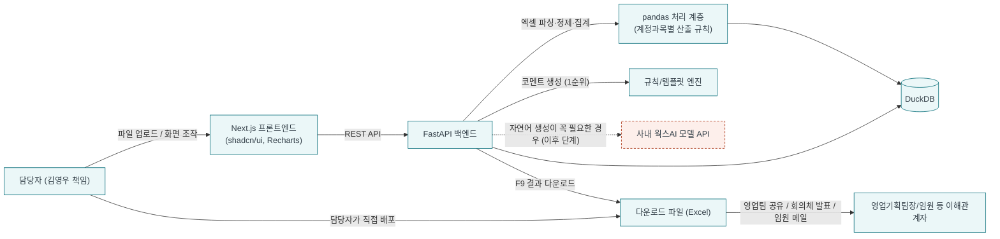

# 기술 스택 — 영업실적·손익 분석 및 보고서 자동 생성 Agent

- 작성 대상: 국내영업본부 국내영업기획팀 김영우 책임
- 근거 문서: [.docs/02_prd.md](02_prd.md) 11장(기술 스택 및 아키텍처), [.docs/03_데이터정제.md](03_데이터정제.md)
- 이 문서는 PRD 11장의 요약이 아니라, 실제 구현 착수 시 참고할 수 있도록 스택별 역할·선정 이유·MVP/이후 단계 적용 범위를 상세화한 것이다. PRD와 내용이 달라지면 이 문서도 함께 갱신한다.

---

## 1. 한 줄 요약

| 항목 | 내용 |
|---|---|
| 담당자 | 김영우 |
| 과제명 | 영업실적·손익 분석 및 보고서 자동 생성 Agent |
| 제품 설명 | SAP 실적 업로드로 팀·제품군별 손익을 집계·이상징후 탐지하고 AI 보고서를 자동 생성하는 웹앱 |
| 아키텍처 | 서버/클라이언트 분리, 사내 서버 상시 배포(담당자 상시 접근용) — 백엔드 FastAPI + 프론트 Next.js |
| 프론트/시각화/코멘트 | shadcn/ui, Recharts, pandas. 코멘트는 규칙/템플릿 기반 우선, 자연어 생성이 꼭 필요하면 사내 웍스AI 모델 API로 모델 선택·호출 |
| 데이터 저장 | DuckDB |
| MVP 범위 | 업로드 · 정제 · 증감률 계산 · 이상징후 플래그 · Overview · 상세 보고서 자동 생성(규칙 기반 코멘트) · 검토·수정 · 결과 다운로드 (F1~F9 전체, 5일 개발 기준) |
| 이후 단계 범위 | 담당자 1인 로그인 보호용 인증 · 사내 서버 배포 · 웍스AI 모델 API를 통한 자연어 코멘트 고도화 등 (v2) |

> MVP/이후 단계 구분은 [.docs/02_prd.md](02_prd.md) 5장(MVP=F1~F9, v2=V1~V6)과 동일한 경계다. 개발 기간이 5일로 재확정되면서 F7~F9(보고서 초안 자동 생성·검토·다운로드)도 MVP에 포함되었다(과거 "v1.5" 구분 폐지). **다중 사용자 권한·앱 내 이메일 발송은 로드맵 전체에서 제외 확정**되었다 (사용자 확인 사항). 업로드부터 다운로드까지 담당자 1인이 전담하고, 이해관계자 배포는 다운로드한 파일을 수동 공유하는 방식을 계속 유지한다.

---

## 2. 아키텍처 다이어그램

실선 = MVP에서 바로 사용하는 경로, 점선 = 이후 단계(v2)에서 활성화되는 경로. 이해관계자(경영진 등)는 앱에 직접 접속하지 않고 담당자가 다운로드한 파일을 통해서만 결과를 받는다 (다중 사용자 권한·앱 내 이메일 발송 로드맵 전체 제외 확정).

---

## 3. 계층별 스택

### 3.1 프론트엔드 — Next.js

| 항목 | 내용 |
|---|---|
| 프레임워크 | Next.js (React) |
| 담당 화면 | F1 업로드, F4 Overview, F5 이상징후 하이라이트, F6 임계치 설정, F7 보고서 초안, F8 검토·수정 (F1~F8 전체 MVP) |
| 컴포넌트 | shadcn/ui — [.docs/design.md](design.md)의 세방 CI 컬러·타이포·간격 토큰을 Tailwind 테마 변수로 매핑해 적용 |
| 시각화 | Recharts — 팀별 순위, 기간별 비교(전월/전년/누계) 증감 추이, 제품구분별 비교 차트 |
| API 통신 | FastAPI 백엔드와 REST API로 통신 (SSR/API Route에서 데이터 가공 로직을 직접 구현하지 않음) |

**Next.js를 API Route/Server Action까지 포함한 풀스택으로 쓰지 않는 이유**: [.docs/03_데이터정제.md](03_데이터정제.md)에서 확인된 실제 데이터 처리 난이도(68개 계정과목별 개별 산출 규칙, "팀+제품코드" 합성 키 매핑, 다양한 엑셀 포맷 파싱) 때문이다. 이 로직을 JS/TS로 재구현하면 pandas 대비 생태계가 얇고 검증 비용이 커진다. 자세한 내용은 §3.2 참고.

### 3.2 백엔드 — FastAPI + pandas

| 항목 | 내용 |
|---|---|
| 프레임워크 | FastAPI (Python) |
| 담당 기능 | F1 파일 업로드 수신·검증, F2 데이터 정제·매핑, F3 증감률·이상징후 계산, F6 임계치 저장/적용, F7 보고서 초안 생성 (F1~F7 전체 MVP) |
| 데이터 처리 | pandas — 엑셀/CSV 파싱, 계정과목별 정제 규칙([.docs/03_데이터정제.md](03_데이터정제.md) §4의 6가지 패턴: 원본값 복사·식별자 파싱·코드매핑·VLOOKUP 매핑·합산차감·최종손익계산) 구현 |

**선정 이유**
1. 이 프로젝트의 핵심 난이도는 UI가 아니라 실제 SAP 엑셀 구조를 정확히 재현하는 데이터 처리 로직에 있다 (근거: [.docs/03_데이터정제.md](03_데이터정제.md) 전체).
2. pandas는 표 형태 데이터의 조인·집계·조건부 계산에 성숙한 생태계를 갖고 있다.
3. 다양한 엑셀 포맷(.xlsx/.xls/.xlsb 등) 파싱 지원이 JS/TS 진영(xlsx, exceljs 등)보다 안정적이다 — 특히 이번에 분석한 원본 파일이 `.xlsb`였고, JS 라이브러리 대부분은 `.xlsb`를 지원하지 않는다.
4. FastAPI는 Python 기반이면서 타입 힌트·자동 API 문서화(OpenAPI)를 지원해, Next.js 프론트와의 계약(스키마)을 명확히 유지하기 좋다.

### 3.3 데이터 저장 — DuckDB

| 항목 | 내용 |
|---|---|
| 종류 | 파일 기반 임베디드 OLAP DB |
| 저장 대상 | UploadBatch, UploadedFile, SalesActualRecord, SalesPlanRecord, TeamPLRecord, ProductMapping, AggregatedResult, CustomerResult, ThresholdConfig, AnomalyFlag, ReportDraft, ReportItem ([.docs/02_prd.md](02_prd.md) 7장 데이터 모델 전체) |
| 선정 이유 | 별도 DB 서버 구축 없이 MVP(로컬 데모)부터 이후 단계(사내 서버 상시 배포)까지 동일한 방식으로 사용할 수 있다. pandas DataFrame과의 상호운용이 자연스러워 백엔드 정제·집계 파이프라인과 궁합이 좋고, 집계·분석 쿼리(OLAP 성격)에 최적화되어 있어 F3·F4의 대량 집계 연산에 적합하다. |

### 3.4 보고서 코멘트 생성 전략

| 우선순위 | 방식 | 적용 시점 | 비고 |
|---|---|---|---|
| 1순위 | 규칙/템플릿 기반 코멘트 생성 | MVP (F7) 기본 구현 | F7 요구사항의 "코멘트는 수치 기반 사실 서술에 한정하고 원인 추정은 하지 않는다" 원칙과 정확히 일치. 결과가 결정론적이고 검증 가능함 |
| 2순위 | 사내 웍스AI 모델 API 호출 (모델 선택·호출) | v2(V6) | 자연어 생성이 꼭 필요한 경우에 한해서만 사용. 외부 LLM API가 아닌 사내 웍스AI를 쓰는 것이 정책 조건 |

---

## 4. MVP vs 이후 단계 적용 범위

| 구분 | 스택/기능 |
|---|---|
| **MVP (F1~F9)** | Next.js + shadcn/ui + Recharts (프론트), FastAPI + pandas (백엔드), DuckDB (저장), 규칙/템플릿 코멘트 엔진 실제 적용(F7), 검토·수정 UI(F8), 결과 다운로드(F9) |
| **v2 (V1~V6)** | 사내 서버 상시 배포(V5, 담당자 상시 접근용), 담당자 1인 로그인 보호용 인증/SSO(V4, 역할별 차등 권한 아님), 웍스AI 모델 API를 통한 자연어 코멘트 고도화(V6) 등 |

이 구분은 [.docs/02_prd.md](02_prd.md) 5장·11.6절과 동일하다. 다중 사용자 권한·앱 내 이메일 발송은 이 로드맵 어디에도 포함하지 않는다 (사용자 확인 사항 — NG1·NG3).

---

## 5. 리스크 및 확인 필요 사항

1. **.xlsb 지원**: pandas 자체는 기본적으로 `.xlsb`를 직접 읽지 못하며 `pyxlsb` 같은 추가 엔진이 필요하다. F1이 다양한 엑셀 포맷을 받아야 하므로, 실제 담당자가 매월 다운로드하는 파일이 `.xlsb`인지 `.xlsx`인지에 따라 필요한 파싱 엔진을 사전에 확정해야 한다 (참고: 이번에 분석한 원본 실적 파일은 `.xlsb`였음 — [.docs/03_데이터정제.md](03_데이터정제.md)).
2. **FastAPI ↔ Next.js 배포 방식**: MVP는 로컬에서 두 프로세스를 함께 띄워 데모하고, v2에서 사내 서버에 상시 배포한다(NG6). 로컬 실행 방법(예: 포트 구성, 프록시 설정)을 5장 F1 착수 전에 정해야 한다.
3. **웍스AI 모델 API 스펙 미확정**: "모델 선택·호출"이라고만 명시되어 있고 구체적인 API 스펙(엔드포인트, 인증 방식, 사용 가능 모델 목록)은 확인되지 않았다. 이 기능 자체는 v2 범위라 MVP 착수를 막지는 않지만, v2 착수 전 확인이 필요하다 (필요 시 [.docs/02_prd.md](02_prd.md) 10장 미해결 질문에 추가).
4. **DuckDB 동시성**: DuckDB는 단일 프로세스 쓰기에 최적화되어 있다. 담당자 1인 전용 원칙이 로드맵 전체에서 유지되므로(NG1) 동시 쓰기 문제는 구조적으로 발생하지 않는다. 다만 v2 서버 상시 배포(V5)로 접속 방식이 바뀌어도 "동시에 여러 명이 쓰는" 상황은 생기지 않는다는 전제를 재확인해 둔다.
