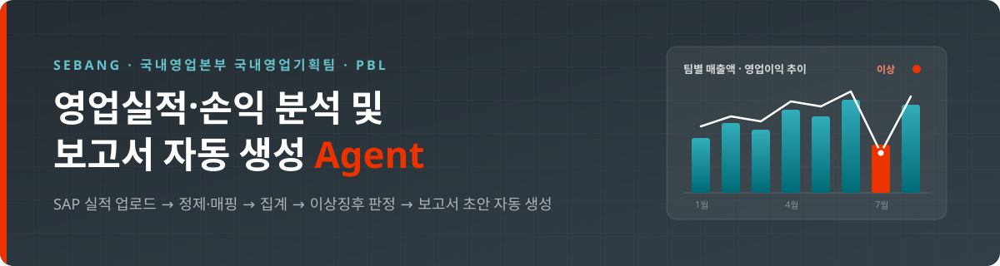
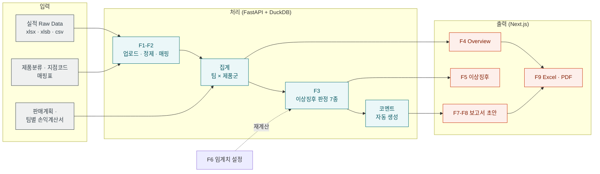
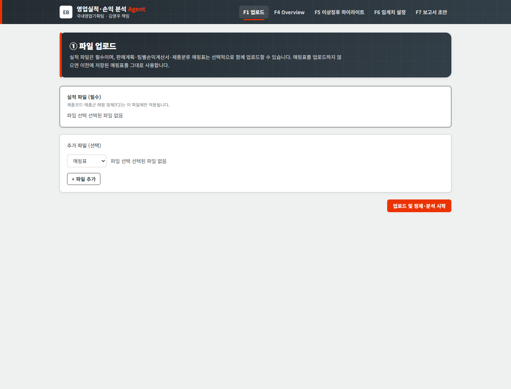
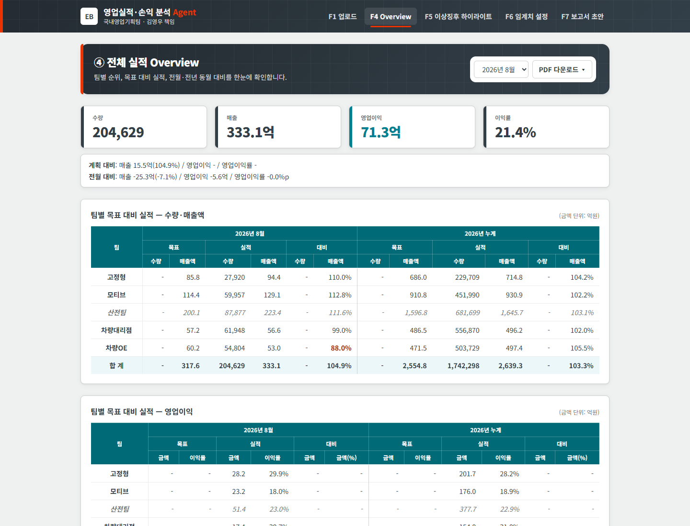
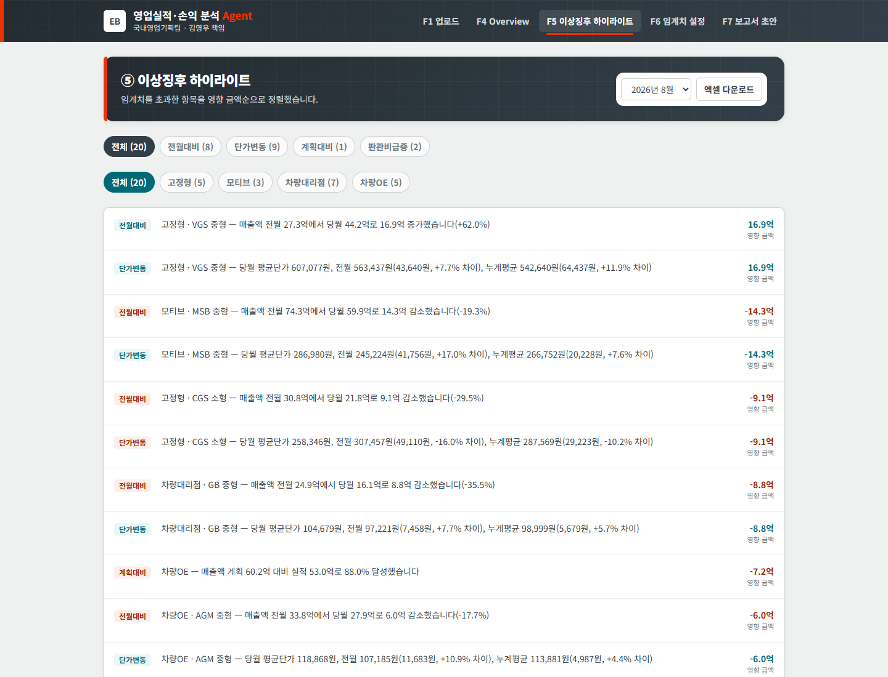
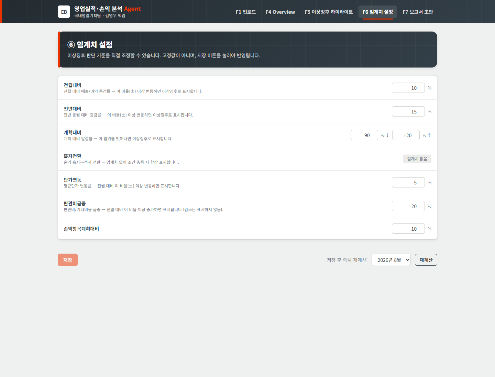
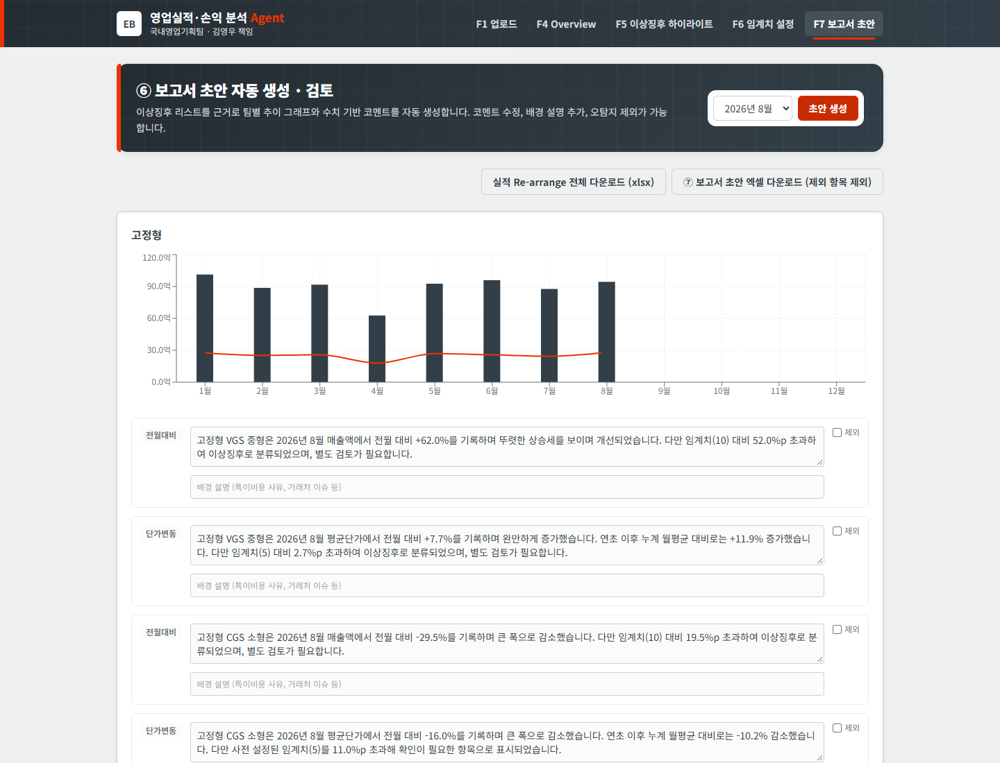

<div align="center">



<br/>


<br/>


</div>

<br/>


국내영업본부 국내영업기획팀(김영우 책임) PBL 과제. SAP ERP에서 다운로드한 실적·손익 데이터를
업로드하면 팀별·제품별 실적/손익을 자동 집계·분석하고, 이상징후를 하이라이트한 보고서
초안까지 자동으로 만들어주는 웹앱입니다.

담당자가 매달 엑셀에서 수작업으로 집계·비교하며 보고서를 작성하던 과정을, 파일 업로드
한 번으로 대체하는 것이 목표입니다.

## 개요

<table>
  <tr><th width="90">단계</th><th align="left">내용</th></tr>
  <tr><td align="center" nowrap><b>입력</b></td><td>SAP에서 내려받은 실적 Raw Data(xlsx/xlsb/csv), 제품분류·지점코드 매핑표, 연간 판매계획, 팀별 손익계산서</td></tr>
  <tr><td align="center" nowrap><b>처리</b></td><td>원본 필드 파싱 → 코드 매핑 → 팀×제품군 집계 → 전월/전년/계획 대비 이상징후 판정(7개 기준) → 서술형 코멘트 자동 생성</td></tr>
  <tr><td align="center" nowrap><b>출력</b></td><td>팀별 목표 대비 실적 Overview 대시보드, 이상징후 하이라이트 화면, 보고서 초안(검토·수정 가능) 및 Excel/PDF 다운로드</td></tr>
</table>



## 주요 기능

- **F1~F2 파일 업로드 및 데이터 정제**: 실적 Raw Data의 식별자(손익센터/부문, 제품, 고객
  등)를 파싱하고, 제품분류·지점코드 매핑표로 팀·제품군·거래처 정보를 보강합니다. 헤더가
  엇갈리거나 컬럼이 다른 실제 SAP 파일의 여러 변형을 흡수하도록 만들었습니다. 실적 파일
  하나에 여러 달이 섞여 있어도 기간별로 자동 분할하고, 기존 배치와 겹치면 덮어쓸지 확인을
  받습니다.
- **F3 이상징후 자동 판정**: 전월대비/전년대비/계획대비/흑자전환/단가변동/판관비급증/
  손익항목계획대비 7개 기준으로 팀×제품군 단위 이상 여부를 자동 판정합니다. 기준 임계치는
  F6 화면에서 조정할 수 있고, 재업로드 없이 즉시 재계산됩니다.
- **F4 Overview 대시보드**: 팀별 목표 대비 실적을 당월(MTD)·연초 누계(YTD)로 함께
  보여주는 매트릭스, 팀 클릭 시 1~12월 추이 차트, 누계 목표 달성률 그래프, 월별 실적
  분석(팀별/제품군별/거래처별)과 손익 상세 비교(계획대비/전월대비 드릴다운)를 제공합니다.
- **F5 이상징후 하이라이트**: 판정 기준·팀별로 필터링해 "전월 X에서 당월 Y로 Z 변동"
  형태의 사실 서술 문장으로 이상징후를 보여줍니다.
- **F7~F8 보고서 자동 생성 및 검토**: 이상징후 목록으로부터 팀별 추이 차트와 함께 원인을
  추정하지 않는 사실 기반 코멘트를 자동 생성하고, 화면에서 코멘트·배경 설명을 직접
  수정하거나 항목을 보고서에서 제외할 수 있습니다.
- **F9 다운로드**: 이상징후·보고서 초안은 Excel(팀별 추이 차트 포함)로, Overview는 PDF로
  내려받을 수 있습니다.

## 기술 스택

<table>
  <tr>
    <th align="left" width="18%">영역</th>
    <th align="left">구성</th>
  </tr>
  <tr>
    <td><b>백엔드</b></td>
    <td>FastAPI, DuckDB(임베디드), pandas/openpyxl/pyxlsb(SAP 파일 파싱), reportlab(PDF 생성), pytest</td>
  </tr>
  <tr>
    <td><b>프론트엔드</b></td>
    <td>Next.js(App Router) + TypeScript, Tailwind CSS, Recharts, Vitest</td>
  </tr>
  <tr>
    <td><b>저장소</b></td>
    <td>DuckDB 파일 하나로 배치·집계·이상징후·보고서까지 전부 관리(별도 서버 불필요)</td>
  </tr>
</table>

## 폴더 구조

```
backend/
  app/
    routers/       # FastAPI 엔드포인트 (uploads, analytics, thresholds, reports, exports)
    services/       # 핵심 로직: 정제(refinement)·매핑(mapping/branch)·집계(aggregation)
                    #   ·이상징후(anomaly)·코멘트(comment_generator)·보고서(reports)·PDF/Excel export
    db.py           # DuckDB 스키마 및 마이그레이션
  tests/            # pytest (실제 검증된 엑셀 값과 대조하는 회귀 테스트 포함)
frontend/
  app/              # 업로드(F1) / Overview(F4) / 이상징후(F5) / 임계치설정(F6) / 보고서(F7-F8)
  components/       # 대시보드 표·차트·필터 컴포넌트
  lib/               # API 클라이언트, 포맷터
.docs/              # PRD, 데이터 정제 조사, 디자인 시스템, Phase별 계획서(번호순)
output/             # 기능별(F1~F9) HTML 화면 목업
screenshots/        # 실행 화면 캡처
```

## 실행 방법

<table>
  <tr>
    <th width="50%">① 백엔드 (FastAPI + DuckDB)</th>
    <th width="50%">② 프론트엔드 (Next.js)</th>
  </tr>
  <tr>
    <td valign="top">

```bash
cd backend
pip install -r requirements.txt
python -m uvicorn app.main:app --reload
```

`http://127.0.0.1:8000/health`로 기동 여부를 확인할 수 있습니다.

</td>
    <td valign="top">

```bash
cd frontend
npm install
npm run dev
```

`http://localhost:3000`에서 확인합니다.

</td>
  </tr>
</table>

백엔드가 `:8000`에서 떠 있어야 API 호출이 성공합니다. `NEXT_PUBLIC_API_BASE_URL`은
`frontend/.env.local`에서 설정합니다(기본값 `http://127.0.0.1:8000`).

> [!TIP]
> 앱이 열리면 "파일 업로드" 화면에서 아래 더미 데이터를 올려 바로 결과를 확인할 수 있습니다.
>
> | 파일 종류 | 더미 파일 |
> |---|---|
> | 실적 | `클로드_실적_데이터_분석용_2_더미.xlsx` |
> | 제품분류·지점코드 매핑 | `맵핑_분석용_더미.xlsx` |
> | 연간 판매계획 | `판매계획_더미데이터.xlsx` |
> | 팀별 손익계산서 | `손익계산서_더미데이터.xlsx` 또는 `손익계산서_더미용.xlsx` |

## 테스트

```bash
# 백엔드
cd backend && python -m pytest -q

# 프론트엔드
cd frontend && npm run test -- --run
cd frontend && npm run lint
cd frontend && npm run build   # 타입 체크 포함

# E2E 스모크 테스트 (백엔드가 :8000에서 떠 있는 상태로)
cd frontend && node scripts/smoke-test.mjs
```

## 화면 예시

<table>
  <tr>
    <td width="50%" align="center"><b>F1 · 업로드</b><br/></td>
    <td width="50%" align="center"><b>F4 · Overview</b><br/></td>
  </tr>
  <tr>
    <td width="50%" align="center"><b>F5 · 이상징후</b><br/></td>
    <td width="50%" align="center"><b>F6 · 임계치 설정</b><br/></td>
  </tr>
  <tr>
    <td colspan="2" align="center"><b>F7-F8 · 보고서</b><br/></td>
  </tr>
</table>

## 데이터에 대한 안내

> [!IMPORTANT]
> 이 저장소에는 실제 세방전지 영업실적·손익 데이터가 포함되어 있지 않습니다.

데이터 구조 조사에 쓰인 원본 참고 파일 3종(`.xlsb`/`.xlsx`, 실제 거래처명·제품코드·금액 포함)은
`.gitignore`로 제외했고, 대신 아래처럼 구조는 동일하되 값은 전부 가상으로 치환한 더미
파일로 대체했습니다.

| 원본(제외) | | 더미 대체 파일(포함) |
|---|:---:|---|
| `클로드 실적 데이터 분석용_2.xlsx` | → | `클로드_실적_데이터_분석용_2_더미.xlsx` |
| `맵핑_분석용.xlsx` | → | `맵핑_분석용_더미.xlsx` |
| `2026년 08월 4. 손익분석 (2단계 배포용)_구조파악용.xlsb` | → | `2026년_08월_4_손익분석_더미.xlsx` |

정제·집계·이상징후 판정 로직은 실제 파일로 검증한 그대로 유지했고(`.docs/03_데이터정제.md`
참고), 더미 파일은 컬럼 구조와 계산 방식만 동일하게 재현한 가상의 값입니다. 로컬
DuckDB(`backend/data/*.duckdb`)도 앱이 업로드 시 자동 재생성하는 런타임 상태라 저장소에
포함하지 않습니다.

<br/>

<div align="center">
<sub>SEBANG · 국내영업본부 국내영업기획팀 · 영업실적·손익 분석 및 보고서 자동 생성 Agent</sub>
</div>
